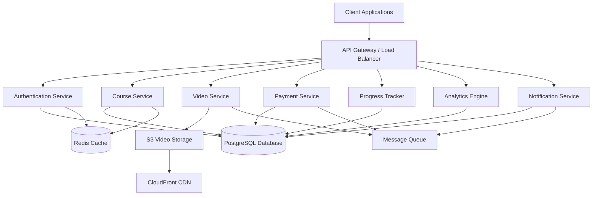
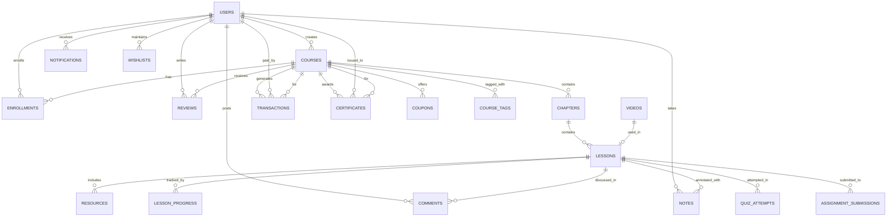
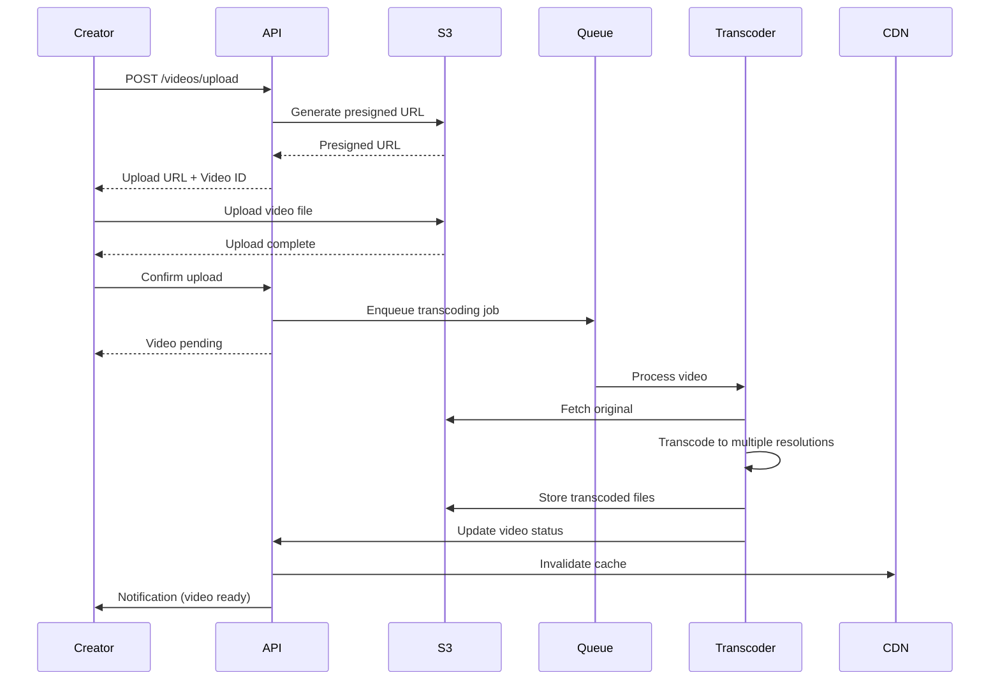
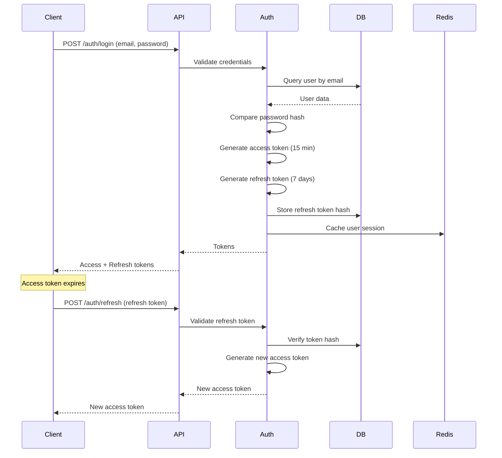

# Learnify Backend API - Technical Design Document

## Overview

The Learnify Backend API is a comprehensive RESTful API system that powers an online learning platform supporting three user roles: Students, Creators, and Admins. The system provides course management, video streaming, payment processing, progress tracking, and analytics capabilities.

### Key Features
- Multi-role authentication and authorization (Student, Creator, Admin)
- Course creation and management with approval workflow
- Video upload, processing, and adaptive streaming
- Payment processing with 90/10 revenue split
- Real-time progress tracking and certificate generation
- Discussion forums and note-taking
- Advanced search and filtering
- Quiz and assignment management
- Analytics dashboards for Creators and Admins
- Notification system
- Discount and coupon management

### Design Goals
- **Scalability**: Support thousands of concurrent users and large video files
- **Security**: Protect user data and enforce role-based access control
- **Performance**: Fast API responses with caching and optimized queries
- **Reliability**: Graceful error handling and data consistency
- **Maintainability**: Clean architecture with separation of concerns

## Architecture

### Architecture Pattern
The system follows a **layered architecture** with clear separation of concerns:


1. **Presentation Layer**: REST API endpoints with request validation
2. **Business Logic Layer**: Service classes implementing core functionality
3. **Data Access Layer**: Repository pattern for database operations
4. **Infrastructure Layer**: External service integrations (storage, payment, email)

### System Components



### Technology Stack

#### Backend Framework
- **Node.js with Express.js**: Chosen for its non-blocking I/O, excellent ecosystem, and strong support for real-time features
- **TypeScript**: For type safety and better developer experience
- **Alternative**: Python with FastAPI for ML-based recommendations in future

#### Database
- **PostgreSQL**: Primary relational database for structured data (users, courses, enrollments, transactions)
  - ACID compliance for payment transactions
  - Strong support for complex queries and joins
  - JSON/JSONB support for flexible schema fields
- **Redis**: In-memory cache for session management, rate limiting, and frequently accessed data

#### Video Storage and Streaming
- **AWS S3**: Object storage for video files and resources
- **AWS CloudFront**: CDN for global video delivery with low latency
- **AWS Elastic Transcoder / MediaConvert**: Video transcoding for multiple resolutions
- **HLS (HTTP Live Streaming)**: Adaptive bitrate streaming protocol

#### File Storage
- **AWS S3**: For course thumbnails, resources (PDFs, ZIPs), certificates, and assignment submissions
- **Separate buckets**: Public (thumbnails), private (course content), user-uploads (assignments)

#### Authentication
- **JWT (JSON Web Tokens)**: Stateless authentication with refresh token rotation
- **bcrypt**: Password hashing with salt rounds
- **OAuth 2.0**: Optional social login (Google, GitHub) for future enhancement

#### Payment Processing
- **Stripe**: Payment gateway for course purchases
- **Stripe Connect**: For revenue distribution to Creators
- **Webhook handling**: For asynchronous payment confirmations

#### Message Queue
- **AWS SQS** or **RabbitMQ**: For asynchronous processing (video transcoding, email notifications, analytics aggregation)

#### Email Service
- **AWS SES** or **SendGrid**: Transactional emails (registration, password reset, notifications)

#### Monitoring and Logging
- **Winston**: Application logging
- **AWS CloudWatch**: Log aggregation and monitoring
- **Sentry**: Error tracking and alerting


## Components and Interfaces

### Authentication Service
Handles user registration, login, session management, and password operations.

**Interface:**
```typescript
interface AuthenticationService {
  register(userData: RegisterDTO): Promise<User>;
  login(credentials: LoginDTO): Promise<AuthTokens>;
  refreshToken(refreshToken: string): Promise<AuthTokens>;
  logout(userId: string): Promise<void>;
  requestPasswordReset(email: string): Promise<void>;
  resetPassword(token: string, newPassword: string): Promise<void>;
  validateToken(token: string): Promise<TokenPayload>;
}

interface RegisterDTO {
  email: string;
  password: string;
  firstName: string;
  lastName: string;
  role: 'student' | 'creator' | 'admin';
}

interface LoginDTO {
  email: string;
  password: string;
}

interface AuthTokens {
  accessToken: string;
  refreshToken: string;
  expiresIn: number;
}
```

### Authorization Service
Enforces role-based access control and resource ownership validation.

**Interface:**
```typescript
interface AuthorizationService {
  checkPermission(userId: string, resource: string, action: string): Promise<boolean>;
  canAccessCourse(userId: string, courseId: string): Promise<boolean>;
  canModifyCourse(userId: string, courseId: string): Promise<boolean>;
  isEnrolled(userId: string, courseId: string): Promise<boolean>;
}
```

### Course Service
Manages course CRUD operations, chapters, lessons, and course structure.

**Interface:**
```typescript
interface CourseService {
  createCourse(creatorId: string, courseData: CreateCourseDTO): Promise<Course>;
  updateCourse(courseId: string, updates: UpdateCourseDTO): Promise<Course>;
  deleteCourse(courseId: string): Promise<void>;
  getCourse(courseId: string): Promise<Course>;
  listCourses(filters: CourseFilters, pagination: Pagination): Promise<PaginatedResult<Course>>;
  submitForReview(courseId: string): Promise<Course>;
  
  addChapter(courseId: string, chapterData: CreateChapterDTO): Promise<Chapter>;
  updateChapter(chapterId: string, updates: UpdateChapterDTO): Promise<Chapter>;
  deleteChapter(chapterId: string): Promise<void>;
  reorderChapters(courseId: string, chapterIds: string[]): Promise<void>;
  
  addLesson(chapterId: string, lessonData: CreateLessonDTO): Promise<Lesson>;
  updateLesson(lessonId: string, updates: UpdateLessonDTO): Promise<Lesson>;
  deleteLesson(lessonId: string): Promise<void>;
  reorderLessons(chapterId: string, lessonIds: string[]): Promise<void>;
}
```

### Video Service
Handles video upload, storage, transcoding, and streaming.

**Interface:**
```typescript
interface VideoService {
  uploadVideo(file: File, metadata: VideoMetadata): Promise<VideoUploadResult>;
  getStreamingUrl(videoId: string, userId: string): Promise<string>;
  getVideoStatus(videoId: string): Promise<VideoStatus>;
  deleteVideo(videoId: string): Promise<void>;
  updatePlaybackPosition(userId: string, videoId: string, position: number): Promise<void>;
  getPlaybackPosition(userId: string, videoId: string): Promise<number>;
}

interface VideoUploadResult {
  videoId: string;
  uploadUrl: string;
  status: 'pending' | 'processing' | 'ready' | 'failed';
}

interface VideoStatus {
  videoId: string;
  status: 'pending' | 'processing' | 'ready' | 'failed';
  duration?: number;
  resolutions?: string[];
  error?: string;
}
```


### Payment Service
Processes payments, manages revenue distribution, and handles withdrawals.

**Interface:**
```typescript
interface PaymentService {
  processPurchase(userId: string, courseId: string, couponCode?: string): Promise<PaymentResult>;
  calculatePrice(courseId: string, couponCode?: string): Promise<PriceCalculation>;
  getCreatorEarnings(creatorId: string): Promise<EarningsReport>;
  requestWithdrawal(creatorId: string, amount: number): Promise<Withdrawal>;
  getTransactionHistory(userId: string, pagination: Pagination): Promise<PaginatedResult<Transaction>>;
}

interface PaymentResult {
  transactionId: string;
  status: 'success' | 'failed' | 'pending';
  amount: number;
  enrollmentId?: string;
}
```

### Progress Tracker
Monitors lesson completion, course progress, and video playback positions.

**Interface:**
```typescript
interface ProgressTracker {
  markLessonComplete(userId: string, lessonId: string): Promise<void>;
  getLessonProgress(userId: string, lessonId: string): Promise<LessonProgress>;
  getCourseProgress(userId: string, courseId: string): Promise<CourseProgress>;
  updateVideoProgress(userId: string, videoId: string, position: number): Promise<void>;
}

interface CourseProgress {
  courseId: string;
  completedLessons: number;
  totalLessons: number;
  completionPercentage: number;
  lastAccessedAt: Date;
}
```

### Certificate Generator
Creates and manages course completion certificates.

**Interface:**
```typescript
interface CertificateGenerator {
  generateCertificate(userId: string, courseId: string): Promise<Certificate>;
  getCertificate(certificateId: string): Promise<Certificate>;
  verifyCertificate(certificateId: string): Promise<CertificateVerification>;
}

interface Certificate {
  certificateId: string;
  userId: string;
  courseId: string;
  studentName: string;
  courseTitle: string;
  completionDate: Date;
  pdfUrl: string;
  shareableUrl: string;
}
```

### Analytics Engine
Aggregates and reports platform and course metrics.

**Interface:**
```typescript
interface AnalyticsEngine {
  getCourseAnalytics(courseId: string, period: TimePeriod): Promise<CourseAnalytics>;
  getCreatorAnalytics(creatorId: string, period: TimePeriod): Promise<CreatorAnalytics>;
  getPlatformAnalytics(period: TimePeriod): Promise<PlatformAnalytics>;
}

interface CourseAnalytics {
  totalEnrollments: number;
  totalRevenue: number;
  averageRating: number;
  completionRate: number;
  revenueByPeriod: TimeSeriesData[];
}
```

### Notification Service
Manages user notifications and delivery.

**Interface:**
```typescript
interface NotificationService {
  createNotification(userId: string, notification: NotificationData): Promise<Notification>;
  getNotifications(userId: string, unreadOnly: boolean): Promise<Notification[]>;
  markAsRead(notificationId: string): Promise<void>;
  markAllAsRead(userId: string): Promise<void>;
}
```


## Data Models

### Database Schema

#### Users Table
```sql
CREATE TABLE users (
  id UUID PRIMARY KEY DEFAULT gen_random_uuid(),
  email VARCHAR(255) UNIQUE NOT NULL,
  password_hash VARCHAR(255) NOT NULL,
  first_name VARCHAR(100) NOT NULL,
  last_name VARCHAR(100) NOT NULL,
  role VARCHAR(20) NOT NULL CHECK (role IN ('student', 'creator', 'admin')),
  is_active BOOLEAN DEFAULT true,
  profile_image_url TEXT,
  bio TEXT,
  created_at TIMESTAMP DEFAULT CURRENT_TIMESTAMP,
  updated_at TIMESTAMP DEFAULT CURRENT_TIMESTAMP
);

CREATE INDEX idx_users_email ON users(email);
CREATE INDEX idx_users_role ON users(role);
```

#### Courses Table
```sql
CREATE TABLE courses (
  id UUID PRIMARY KEY DEFAULT gen_random_uuid(),
  creator_id UUID NOT NULL REFERENCES users(id) ON DELETE CASCADE,
  title VARCHAR(255) NOT NULL,
  description TEXT NOT NULL,
  thumbnail_url TEXT,
  trailer_video_id UUID,
  category VARCHAR(100) NOT NULL,
  difficulty_level VARCHAR(20) CHECK (difficulty_level IN ('beginner', 'intermediate', 'advanced')),
  price DECIMAL(10, 2) NOT NULL,
  discount_price DECIMAL(10, 2),
  status VARCHAR(20) NOT NULL DEFAULT 'draft' CHECK (status IN ('draft', 'pending', 'published', 'rejected')),
  rejection_reason TEXT,
  average_rating DECIMAL(3, 2) DEFAULT 0,
  total_ratings INTEGER DEFAULT 0,
  total_enrollments INTEGER DEFAULT 0,
  created_at TIMESTAMP DEFAULT CURRENT_TIMESTAMP,
  updated_at TIMESTAMP DEFAULT CURRENT_TIMESTAMP,
  published_at TIMESTAMP
);

CREATE INDEX idx_courses_creator ON courses(creator_id);
CREATE INDEX idx_courses_status ON courses(status);
CREATE INDEX idx_courses_category ON courses(category);
CREATE INDEX idx_courses_published ON courses(published_at) WHERE status = 'published';
```

#### Course Tags Table
```sql
CREATE TABLE course_tags (
  id UUID PRIMARY KEY DEFAULT gen_random_uuid(),
  course_id UUID NOT NULL REFERENCES courses(id) ON DELETE CASCADE,
  tag VARCHAR(50) NOT NULL,
  created_at TIMESTAMP DEFAULT CURRENT_TIMESTAMP
);

CREATE INDEX idx_course_tags_course ON course_tags(course_id);
CREATE INDEX idx_course_tags_tag ON course_tags(tag);
CREATE UNIQUE INDEX idx_course_tags_unique ON course_tags(course_id, tag);
```

#### Chapters Table
```sql
CREATE TABLE chapters (
  id UUID PRIMARY KEY DEFAULT gen_random_uuid(),
  course_id UUID NOT NULL REFERENCES courses(id) ON DELETE CASCADE,
  title VARCHAR(255) NOT NULL,
  description TEXT,
  order_index INTEGER NOT NULL,
  created_at TIMESTAMP DEFAULT CURRENT_TIMESTAMP,
  updated_at TIMESTAMP DEFAULT CURRENT_TIMESTAMP
);

CREATE INDEX idx_chapters_course ON chapters(course_id);
CREATE INDEX idx_chapters_order ON chapters(course_id, order_index);
```

#### Lessons Table
```sql
CREATE TABLE lessons (
  id UUID PRIMARY KEY DEFAULT gen_random_uuid(),
  chapter_id UUID NOT NULL REFERENCES chapters(id) ON DELETE CASCADE,
  title VARCHAR(255) NOT NULL,
  description TEXT,
  lesson_type VARCHAR(20) NOT NULL CHECK (lesson_type IN ('video', 'quiz', 'reading', 'assignment')),
  content JSONB, -- Stores type-specific content (video_id, quiz questions, reading text, etc.)
  duration_minutes INTEGER,
  order_index INTEGER NOT NULL,
  is_preview BOOLEAN DEFAULT false,
  created_at TIMESTAMP DEFAULT CURRENT_TIMESTAMP,
  updated_at TIMESTAMP DEFAULT CURRENT_TIMESTAMP
);

CREATE INDEX idx_lessons_chapter ON lessons(chapter_id);
CREATE INDEX idx_lessons_order ON lessons(chapter_id, order_index);
CREATE INDEX idx_lessons_type ON lessons(lesson_type);
```


#### Resources Table
```sql
CREATE TABLE resources (
  id UUID PRIMARY KEY DEFAULT gen_random_uuid(),
  lesson_id UUID NOT NULL REFERENCES lessons(id) ON DELETE CASCADE,
  title VARCHAR(255) NOT NULL,
  file_type VARCHAR(50) NOT NULL,
  file_size_bytes BIGINT NOT NULL,
  file_url TEXT NOT NULL,
  created_at TIMESTAMP DEFAULT CURRENT_TIMESTAMP
);

CREATE INDEX idx_resources_lesson ON resources(lesson_id);
```

#### Videos Table
```sql
CREATE TABLE videos (
  id UUID PRIMARY KEY DEFAULT gen_random_uuid(),
  uploader_id UUID NOT NULL REFERENCES users(id),
  original_filename VARCHAR(255) NOT NULL,
  s3_key TEXT NOT NULL,
  duration_seconds INTEGER,
  status VARCHAR(20) NOT NULL DEFAULT 'pending' CHECK (status IN ('pending', 'processing', 'ready', 'failed')),
  error_message TEXT,
  resolutions JSONB, -- Array of available resolutions with URLs
  created_at TIMESTAMP DEFAULT CURRENT_TIMESTAMP,
  updated_at TIMESTAMP DEFAULT CURRENT_TIMESTAMP
);

CREATE INDEX idx_videos_uploader ON videos(uploader_id);
CREATE INDEX idx_videos_status ON videos(status);
```

#### Enrollments Table
```sql
CREATE TABLE enrollments (
  id UUID PRIMARY KEY DEFAULT gen_random_uuid(),
  student_id UUID NOT NULL REFERENCES users(id) ON DELETE CASCADE,
  course_id UUID NOT NULL REFERENCES courses(id) ON DELETE CASCADE,
  enrolled_at TIMESTAMP DEFAULT CURRENT_TIMESTAMP,
  last_accessed_at TIMESTAMP,
  UNIQUE(student_id, course_id)
);

CREATE INDEX idx_enrollments_student ON enrollments(student_id);
CREATE INDEX idx_enrollments_course ON enrollments(course_id);
```


#### Lesson Progress Table
```sql
CREATE TABLE lesson_progress (
  id UUID PRIMARY KEY DEFAULT gen_random_uuid(),
  student_id UUID NOT NULL REFERENCES users(id) ON DELETE CASCADE,
  lesson_id UUID NOT NULL REFERENCES lessons(id) ON DELETE CASCADE,
  is_completed BOOLEAN DEFAULT false,
  completed_at TIMESTAMP,
  last_accessed_at TIMESTAMP DEFAULT CURRENT_TIMESTAMP,
  video_position_seconds INTEGER DEFAULT 0,
  UNIQUE(student_id, lesson_id)
);

CREATE INDEX idx_lesson_progress_student ON lesson_progress(student_id);
CREATE INDEX idx_lesson_progress_lesson ON lesson_progress(lesson_id);
```

#### Quiz Attempts Table
```sql
CREATE TABLE quiz_attempts (
  id UUID PRIMARY KEY DEFAULT gen_random_uuid(),
  student_id UUID NOT NULL REFERENCES users(id) ON DELETE CASCADE,
  lesson_id UUID NOT NULL REFERENCES lessons(id) ON DELETE CASCADE,
  answers JSONB NOT NULL,
  score DECIMAL(5, 2) NOT NULL,
  attempted_at TIMESTAMP DEFAULT CURRENT_TIMESTAMP
);

CREATE INDEX idx_quiz_attempts_student ON quiz_attempts(student_id);
CREATE INDEX idx_quiz_attempts_lesson ON quiz_attempts(lesson_id);
```

#### Assignment Submissions Table
```sql
CREATE TABLE assignment_submissions (
  id UUID PRIMARY KEY DEFAULT gen_random_uuid(),
  student_id UUID NOT NULL REFERENCES users(id) ON DELETE CASCADE,
  lesson_id UUID NOT NULL REFERENCES lessons(id) ON DELETE CASCADE,
  submission_url TEXT NOT NULL,
  submitted_at TIMESTAMP DEFAULT CURRENT_TIMESTAMP,
  grade DECIMAL(5, 2),
  feedback TEXT,
  graded_at TIMESTAMP,
  graded_by UUID REFERENCES users(id)
);

CREATE INDEX idx_assignment_submissions_student ON assignment_submissions(student_id);
CREATE INDEX idx_assignment_submissions_lesson ON assignment_submissions(lesson_id);
```


#### Certificates Table
```sql
CREATE TABLE certificates (
  id UUID PRIMARY KEY DEFAULT gen_random_uuid(),
  student_id UUID NOT NULL REFERENCES users(id) ON DELETE CASCADE,
  course_id UUID NOT NULL REFERENCES courses(id) ON DELETE CASCADE,
  certificate_number VARCHAR(50) UNIQUE NOT NULL,
  issued_at TIMESTAMP DEFAULT CURRENT_TIMESTAMP,
  pdf_url TEXT NOT NULL,
  UNIQUE(student_id, course_id)
);

CREATE INDEX idx_certificates_student ON certificates(student_id);
CREATE INDEX idx_certificates_course ON certificates(course_id);
CREATE INDEX idx_certificates_number ON certificates(certificate_number);
```

#### Transactions Table
```sql
CREATE TABLE transactions (
  id UUID PRIMARY KEY DEFAULT gen_random_uuid(),
  student_id UUID NOT NULL REFERENCES users(id),
  course_id UUID NOT NULL REFERENCES courses(id),
  creator_id UUID NOT NULL REFERENCES users(id),
  amount DECIMAL(10, 2) NOT NULL,
  platform_fee DECIMAL(10, 2) NOT NULL,
  creator_earnings DECIMAL(10, 2) NOT NULL,
  stripe_payment_id VARCHAR(255),
  status VARCHAR(20) NOT NULL CHECK (status IN ('pending', 'completed', 'failed', 'refunded')),
  created_at TIMESTAMP DEFAULT CURRENT_TIMESTAMP
);

CREATE INDEX idx_transactions_student ON transactions(student_id);
CREATE INDEX idx_transactions_creator ON transactions(creator_id);
CREATE INDEX idx_transactions_course ON transactions(course_id);
CREATE INDEX idx_transactions_status ON transactions(status);
```

#### Withdrawals Table
```sql
CREATE TABLE withdrawals (
  id UUID PRIMARY KEY DEFAULT gen_random_uuid(),
  creator_id UUID NOT NULL REFERENCES users(id),
  amount DECIMAL(10, 2) NOT NULL,
  status VARCHAR(20) NOT NULL CHECK (status IN ('pending', 'processing', 'completed', 'failed')),
  stripe_transfer_id VARCHAR(255),
  requested_at TIMESTAMP DEFAULT CURRENT_TIMESTAMP,
  processed_at TIMESTAMP
);

CREATE INDEX idx_withdrawals_creator ON withdrawals(creator_id);
CREATE INDEX idx_withdrawals_status ON withdrawals(status);
```


#### Reviews Table
```sql
CREATE TABLE reviews (
  id UUID PRIMARY KEY DEFAULT gen_random_uuid(),
  student_id UUID NOT NULL REFERENCES users(id) ON DELETE CASCADE,
  course_id UUID NOT NULL REFERENCES courses(id) ON DELETE CASCADE,
  rating INTEGER NOT NULL CHECK (rating >= 1 AND rating <= 5),
  review_text TEXT,
  created_at TIMESTAMP DEFAULT CURRENT_TIMESTAMP,
  updated_at TIMESTAMP DEFAULT CURRENT_TIMESTAMP,
  UNIQUE(student_id, course_id)
);

CREATE INDEX idx_reviews_student ON reviews(student_id);
CREATE INDEX idx_reviews_course ON reviews(course_id);
CREATE INDEX idx_reviews_rating ON reviews(rating);
```

#### Comments Table
```sql
CREATE TABLE comments (
  id UUID PRIMARY KEY DEFAULT gen_random_uuid(),
  lesson_id UUID NOT NULL REFERENCES lessons(id) ON DELETE CASCADE,
  user_id UUID NOT NULL REFERENCES users(id) ON DELETE CASCADE,
  parent_comment_id UUID REFERENCES comments(id) ON DELETE CASCADE,
  content TEXT NOT NULL,
  created_at TIMESTAMP DEFAULT CURRENT_TIMESTAMP,
  updated_at TIMESTAMP DEFAULT CURRENT_TIMESTAMP
);

CREATE INDEX idx_comments_lesson ON comments(lesson_id);
CREATE INDEX idx_comments_user ON comments(user_id);
CREATE INDEX idx_comments_parent ON comments(parent_comment_id);
```

#### Notes Table
```sql
CREATE TABLE notes (
  id UUID PRIMARY KEY DEFAULT gen_random_uuid(),
  student_id UUID NOT NULL REFERENCES users(id) ON DELETE CASCADE,
  lesson_id UUID NOT NULL REFERENCES lessons(id) ON DELETE CASCADE,
  content TEXT NOT NULL,
  video_timestamp_seconds INTEGER,
  created_at TIMESTAMP DEFAULT CURRENT_TIMESTAMP,
  updated_at TIMESTAMP DEFAULT CURRENT_TIMESTAMP
);

CREATE INDEX idx_notes_student ON notes(student_id);
CREATE INDEX idx_notes_lesson ON notes(lesson_id);
```


#### Notifications Table
```sql
CREATE TABLE notifications (
  id UUID PRIMARY KEY DEFAULT gen_random_uuid(),
  user_id UUID NOT NULL REFERENCES users(id) ON DELETE CASCADE,
  type VARCHAR(50) NOT NULL,
  title VARCHAR(255) NOT NULL,
  message TEXT NOT NULL,
  related_entity_type VARCHAR(50),
  related_entity_id UUID,
  is_read BOOLEAN DEFAULT false,
  created_at TIMESTAMP DEFAULT CURRENT_TIMESTAMP
);

CREATE INDEX idx_notifications_user ON notifications(user_id);
CREATE INDEX idx_notifications_read ON notifications(user_id, is_read);
```

#### Wishlists Table
```sql
CREATE TABLE wishlists (
  id UUID PRIMARY KEY DEFAULT gen_random_uuid(),
  student_id UUID NOT NULL REFERENCES users(id) ON DELETE CASCADE,
  course_id UUID NOT NULL REFERENCES courses(id) ON DELETE CASCADE,
  added_at TIMESTAMP DEFAULT CURRENT_TIMESTAMP,
  UNIQUE(student_id, course_id)
);

CREATE INDEX idx_wishlists_student ON wishlists(student_id);
CREATE INDEX idx_wishlists_course ON wishlists(course_id);
```

#### Coupons Table
```sql
CREATE TABLE coupons (
  id UUID PRIMARY KEY DEFAULT gen_random_uuid(),
  course_id UUID NOT NULL REFERENCES courses(id) ON DELETE CASCADE,
  code VARCHAR(50) UNIQUE NOT NULL,
  discount_percentage INTEGER NOT NULL CHECK (discount_percentage > 0 AND discount_percentage <= 100),
  max_uses INTEGER,
  current_uses INTEGER DEFAULT 0,
  expires_at TIMESTAMP,
  is_active BOOLEAN DEFAULT true,
  created_at TIMESTAMP DEFAULT CURRENT_TIMESTAMP
);

CREATE INDEX idx_coupons_code ON coupons(code);
CREATE INDEX idx_coupons_course ON coupons(course_id);
CREATE INDEX idx_coupons_active ON coupons(is_active, expires_at);
```


#### Refresh Tokens Table
```sql
CREATE TABLE refresh_tokens (
  id UUID PRIMARY KEY DEFAULT gen_random_uuid(),
  user_id UUID NOT NULL REFERENCES users(id) ON DELETE CASCADE,
  token_hash VARCHAR(255) NOT NULL,
  expires_at TIMESTAMP NOT NULL,
  created_at TIMESTAMP DEFAULT CURRENT_TIMESTAMP,
  revoked_at TIMESTAMP
);

CREATE INDEX idx_refresh_tokens_user ON refresh_tokens(user_id);
CREATE INDEX idx_refresh_tokens_hash ON refresh_tokens(token_hash);
```

### Entity Relationships




## API Endpoints

### Authentication Endpoints

```
POST   /api/v1/auth/register          - Register new user
POST   /api/v1/auth/login             - Login user
POST   /api/v1/auth/refresh           - Refresh access token
POST   /api/v1/auth/logout            - Logout user
POST   /api/v1/auth/password/reset    - Request password reset
POST   /api/v1/auth/password/confirm  - Confirm password reset
GET    /api/v1/auth/me                - Get current user profile
```

### User Management Endpoints

```
GET    /api/v1/users                  - List users (Admin only)
GET    /api/v1/users/:id              - Get user by ID
PUT    /api/v1/users/:id              - Update user profile
DELETE /api/v1/users/:id              - Deactivate user (Admin only)
PATCH  /api/v1/users/:id/activate     - Activate user (Admin only)
PATCH  /api/v1/users/:id/role         - Change user role (Admin only)
```

### Course Endpoints

```
POST   /api/v1/courses                - Create course (Creator)
GET    /api/v1/courses                - List published courses
GET    /api/v1/courses/:id            - Get course details
PUT    /api/v1/courses/:id            - Update course (Creator/Owner)
DELETE /api/v1/courses/:id            - Delete course (Creator/Owner)
POST   /api/v1/courses/:id/submit     - Submit for review (Creator/Owner)
GET    /api/v1/courses/my             - Get creator's courses (Creator)
GET    /api/v1/courses/pending        - Get pending courses (Admin)
PATCH  /api/v1/courses/:id/approve    - Approve course (Admin)
PATCH  /api/v1/courses/:id/reject     - Reject course (Admin)
```

### Chapter Endpoints

```
POST   /api/v1/courses/:courseId/chapters           - Add chapter
GET    /api/v1/courses/:courseId/chapters           - List chapters
PUT    /api/v1/chapters/:id                         - Update chapter
DELETE /api/v1/chapters/:id                         - Delete chapter
PATCH  /api/v1/courses/:courseId/chapters/reorder   - Reorder chapters
```

### Lesson Endpoints

```
POST   /api/v1/chapters/:chapterId/lessons        - Add lesson
GET    /api/v1/chapters/:chapterId/lessons        - List lessons
GET    /api/v1/lessons/:id                        - Get lesson details
PUT    /api/v1/lessons/:id                        - Update lesson
DELETE /api/v1/lessons/:id                        - Delete lesson
PATCH  /api/v1/chapters/:chapterId/lessons/reorder - Reorder lessons
POST   /api/v1/lessons/:id/duplicate              - Duplicate lesson
```


### Video Endpoints

```
POST   /api/v1/videos/upload          - Upload video
GET    /api/v1/videos/:id/status      - Get video processing status
GET    /api/v1/videos/:id/stream      - Get streaming URL
DELETE /api/v1/videos/:id             - Delete video
PATCH  /api/v1/videos/:id/position    - Update playback position
GET    /api/v1/videos/:id/position    - Get playback position
```

### Resource Endpoints

```
POST   /api/v1/lessons/:lessonId/resources  - Upload resource
GET    /api/v1/lessons/:lessonId/resources  - List resources
GET    /api/v1/resources/:id/download       - Download resource
DELETE /api/v1/resources/:id                - Delete resource
```

### Enrollment Endpoints

```
POST   /api/v1/enrollments            - Enroll in course (via payment)
GET    /api/v1/enrollments            - Get user's enrollments
GET    /api/v1/enrollments/:id        - Get enrollment details
GET    /api/v1/courses/:id/students   - Get course enrollments (Creator/Admin)
```

### Progress Tracking Endpoints

```
POST   /api/v1/progress/lessons/:id/complete  - Mark lesson complete
GET    /api/v1/progress/courses/:id           - Get course progress
GET    /api/v1/progress/lessons/:id           - Get lesson progress
```

### Quiz Endpoints

```
POST   /api/v1/lessons/:id/quiz/submit        - Submit quiz answers
GET    /api/v1/lessons/:id/quiz/attempts      - Get quiz attempts
GET    /api/v1/lessons/:id/quiz/attempts/:id  - Get specific attempt
```

### Assignment Endpoints

```
POST   /api/v1/lessons/:id/assignment/submit  - Submit assignment
GET    /api/v1/lessons/:id/assignment/submissions - Get submissions (Creator)
PATCH  /api/v1/assignments/:id/grade          - Grade assignment (Creator)
```


### Certificate Endpoints

```
GET    /api/v1/certificates                   - Get user's certificates
GET    /api/v1/certificates/:id               - Get certificate details
GET    /api/v1/certificates/:id/download      - Download certificate PDF
GET    /api/v1/certificates/verify/:number    - Verify certificate
```

### Payment Endpoints

```
POST   /api/v1/payments/purchase              - Purchase course
POST   /api/v1/payments/calculate             - Calculate price with coupon
GET    /api/v1/payments/transactions          - Get transaction history
POST   /api/v1/payments/webhook               - Stripe webhook handler
```

### Withdrawal Endpoints

```
POST   /api/v1/withdrawals                    - Request withdrawal (Creator)
GET    /api/v1/withdrawals                    - Get withdrawal history (Creator)
GET    /api/v1/withdrawals/earnings           - Get earnings summary (Creator)
```

### Review Endpoints

```
POST   /api/v1/courses/:id/reviews            - Submit review
GET    /api/v1/courses/:id/reviews            - Get course reviews
PUT    /api/v1/reviews/:id                    - Update review
DELETE /api/v1/reviews/:id                    - Delete review
```

### Comment Endpoints

```
POST   /api/v1/lessons/:id/comments           - Post comment
GET    /api/v1/lessons/:id/comments           - Get lesson comments
PUT    /api/v1/comments/:id                   - Update comment
DELETE /api/v1/comments/:id                   - Delete comment
POST   /api/v1/comments/:id/reply             - Reply to comment
```

### Note Endpoints

```
POST   /api/v1/lessons/:id/notes              - Create note
GET    /api/v1/lessons/:id/notes              - Get lesson notes
PUT    /api/v1/notes/:id                      - Update note
DELETE /api/v1/notes/:id                      - Delete note
```


### Notification Endpoints

```
GET    /api/v1/notifications                  - Get user notifications
PATCH  /api/v1/notifications/:id/read         - Mark notification as read
PATCH  /api/v1/notifications/read-all         - Mark all as read
```

### Wishlist Endpoints

```
POST   /api/v1/wishlist                       - Add to wishlist
GET    /api/v1/wishlist                       - Get wishlist
DELETE /api/v1/wishlist/:courseId             - Remove from wishlist
```

### Coupon Endpoints

```
POST   /api/v1/courses/:id/coupons            - Create coupon (Creator)
GET    /api/v1/courses/:id/coupons            - List coupons (Creator)
PATCH  /api/v1/coupons/:id                    - Update coupon (Creator)
DELETE /api/v1/coupons/:id                    - Deactivate coupon (Creator)
POST   /api/v1/coupons/validate               - Validate coupon code
```

### Search Endpoints

```
GET    /api/v1/search/courses                 - Search courses
GET    /api/v1/categories                     - Get course categories
```

### Analytics Endpoints

```
GET    /api/v1/analytics/courses/:id          - Course analytics (Creator)
GET    /api/v1/analytics/creator              - Creator analytics
GET    /api/v1/analytics/platform             - Platform analytics (Admin)
```

### Export Endpoints

```
POST   /api/v1/exports/enrollments            - Export enrollments (Creator)
POST   /api/v1/exports/transactions           - Export transactions (Creator)
POST   /api/v1/exports/reviews                - Export reviews (Creator)
GET    /api/v1/exports/:id/download           - Download export file
```


## Video Processing Pipeline

### Video Upload Flow



### Video Processing Steps

1. **Upload**: Creator uploads video to S3 via presigned URL (direct upload, bypassing API server)
2. **Validation**: Verify file type, size, and format
3. **Queueing**: Add transcoding job to message queue
4. **Transcoding**: Convert video to multiple resolutions (360p, 480p, 720p, 1080p)
5. **HLS Generation**: Create HLS manifest files for adaptive streaming
6. **Storage**: Store transcoded files in S3 with appropriate folder structure
7. **CDN Distribution**: Files automatically distributed via CloudFront
8. **Status Update**: Update video status to 'ready' in database
9. **Notification**: Notify creator that video is ready

### Video Storage Structure

```
s3://learnify-videos/
  ├── originals/
  │   └── {video_id}/
  │       └── original.mp4
  ├── transcoded/
  │   └── {video_id}/
  │       ├── 360p/
  │       │   ├── segment_001.ts
  │       │   ├── segment_002.ts
  │       │   └── playlist.m3u8
  │       ├── 720p/
  │       └── 1080p/
  └── thumbnails/
      └── {video_id}/
          └── thumbnail.jpg
```

### Streaming Implementation

- **Protocol**: HLS (HTTP Live Streaming)
- **Adaptive Bitrate**: Automatically switches quality based on bandwidth
- **Signed URLs**: Time-limited CloudFront signed URLs for security
- **DRM**: Optional integration with AWS Elemental MediaPackage for content protection


## Security Design

### Authentication Flow



### Authorization Middleware

```typescript
// Role-based authorization middleware
const authorize = (...allowedRoles: string[]) => {
  return async (req: Request, res: Response, next: NextFunction) => {
    const user = req.user; // Set by authentication middleware
    
    if (!user) {
      return res.status(401).json({ error: 'Unauthorized' });
    }
    
    if (!allowedRoles.includes(user.role)) {
      return res.status(403).json({ error: 'Forbidden' });
    }
    
    next();
  };
};

// Resource ownership validation
const authorizeOwnership = (resourceType: string) => {
  return async (req: Request, res: Response, next: NextFunction) => {
    const resourceId = req.params.id;
    const userId = req.user.id;
    
    const isOwner = await checkOwnership(resourceType, resourceId, userId);
    
    if (!isOwner && req.user.role !== 'admin') {
      return res.status(403).json({ error: 'Forbidden' });
    }
    
    next();
  };
};
```

### Security Measures

1. **Password Security**
   - bcrypt hashing with 12 salt rounds
   - Minimum password length: 8 characters
   - Password complexity requirements

2. **Token Security**
   - JWT with RS256 algorithm (asymmetric keys)
   - Short-lived access tokens (15 minutes)
   - Refresh token rotation on use
   - Token revocation via database blacklist

3. **API Security**
   - Rate limiting: 100 requests/minute per user
   - CORS configuration with whitelist
   - Helmet.js for security headers
   - Input sanitization to prevent XSS
   - Parameterized queries to prevent SQL injection

4. **Data Encryption**
   - TLS 1.3 for data in transit
   - S3 server-side encryption (AES-256) for data at rest
   - Database encryption at rest

5. **Access Control**
   - Role-based access control (RBAC)
   - Resource ownership validation
   - Enrollment verification for course content


## Performance Considerations

### Caching Strategy

#### Redis Cache Layers

1. **Session Cache**
   - User sessions and JWT validation
   - TTL: 15 minutes (access token lifetime)
   - Key pattern: `session:{userId}`

2. **Course Catalog Cache**
   - Published course listings
   - TTL: 5 minutes
   - Key pattern: `courses:list:{filters_hash}`
   - Invalidation: On course publish/update

3. **Course Details Cache**
   - Individual course data with chapters and lessons
   - TTL: 10 minutes
   - Key pattern: `course:{courseId}`
   - Invalidation: On course update

4. **User Enrollment Cache**
   - User's enrolled courses
   - TTL: 30 minutes
   - Key pattern: `enrollments:{userId}`
   - Invalidation: On new enrollment

5. **Analytics Cache**
   - Aggregated analytics data
   - TTL: 1 hour
   - Key pattern: `analytics:{type}:{id}:{period}`
   - Invalidation: Daily batch update

### Database Optimization

#### Indexing Strategy

1. **Primary Indexes**: All foreign keys indexed
2. **Composite Indexes**: 
   - `(course_id, status)` for course queries
   - `(user_id, is_read)` for notifications
   - `(course_id, order_index)` for chapters/lessons
3. **Full-Text Search**: PostgreSQL full-text search on course titles and descriptions
4. **Partial Indexes**: Index only published courses for marketplace queries

#### Query Optimization

1. **Eager Loading**: Use JOIN queries to fetch related data in single query
2. **Pagination**: Cursor-based pagination for large result sets
3. **Connection Pooling**: Maintain 20-50 database connections
4. **Read Replicas**: Route read queries to replicas for scalability

### API Response Optimization

1. **Pagination**: Default 20 items per page, max 100
2. **Field Selection**: Allow clients to specify required fields
3. **Response Compression**: gzip compression for responses > 1KB
4. **ETags**: Cache validation for unchanged resources

### Video Streaming Optimization

1. **CDN Caching**: CloudFront edge caching with 24-hour TTL
2. **Adaptive Bitrate**: HLS automatically adjusts quality
3. **Lazy Loading**: Load video segments on demand
4. **Thumbnail Generation**: Pre-generate thumbnails for quick preview


## Integration Points

### Payment Gateway (Stripe)

**Integration Type**: REST API + Webhooks

**Key Operations**:
- Create payment intent for course purchase
- Handle payment confirmation via webhooks
- Stripe Connect for creator payouts
- Refund processing

**Webhook Events**:
- `payment_intent.succeeded`: Create enrollment
- `payment_intent.failed`: Log failure, notify user
- `transfer.created`: Record creator payout
- `charge.refunded`: Handle refund logic

**Configuration**:
```typescript
const stripe = new Stripe(process.env.STRIPE_SECRET_KEY, {
  apiVersion: '2023-10-16',
});

// Create payment intent
const paymentIntent = await stripe.paymentIntents.create({
  amount: priceInCents,
  currency: 'usd',
  metadata: {
    courseId,
    userId,
  },
});

// Stripe Connect for creator payouts
const transfer = await stripe.transfers.create({
  amount: creatorEarnings,
  currency: 'usd',
  destination: creatorStripeAccountId,
});
```

### Email Service (AWS SES / SendGrid)

**Integration Type**: REST API

**Email Templates**:
- Welcome email on registration
- Password reset email
- Course enrollment confirmation
- Course approval/rejection notification
- New content notification for enrolled students
- Certificate generation notification
- Withdrawal confirmation

**Configuration**:
```typescript
const sendEmail = async (to: string, template: string, data: any) => {
  await ses.sendTemplatedEmail({
    Source: 'noreply@learnify.com',
    Destination: { ToAddresses: [to] },
    Template: template,
    TemplateData: JSON.stringify(data),
  });
};
```

### Video Storage (AWS S3)

**Integration Type**: AWS SDK

**Bucket Configuration**:
- `learnify-videos-prod`: Private bucket for course videos
- `learnify-resources-prod`: Private bucket for downloadable resources
- `learnify-public-prod`: Public bucket for thumbnails and trailers
- `learnify-uploads-prod`: Temporary bucket for user uploads

**Presigned URL Generation**:
```typescript
const getUploadUrl = async (videoId: string, contentType: string) => {
  const params = {
    Bucket: 'learnify-videos-prod',
    Key: `originals/${videoId}/original.mp4`,
    ContentType: contentType,
    Expires: 3600, // 1 hour
  };
  
  return s3.getSignedUrlPromise('putObject', params);
};
```


### CDN (AWS CloudFront)

**Integration Type**: AWS SDK

**Configuration**:
- Origin: S3 buckets
- Signed URLs for private content
- Custom domain with SSL certificate
- Cache behaviors for different content types

**Signed URL Generation**:
```typescript
const getStreamingUrl = async (videoId: string, userId: string) => {
  // Verify user enrollment
  const hasAccess = await checkEnrollment(userId, videoId);
  if (!hasAccess) throw new Error('Unauthorized');
  
  const url = `https://cdn.learnify.com/videos/${videoId}/playlist.m3u8`;
  const expiration = Date.now() + 3600000; // 1 hour
  
  return cloudfront.getSignedUrl({
    url,
    expires: expiration,
  });
};
```

### Video Transcoding (AWS MediaConvert)

**Integration Type**: AWS SDK + SQS

**Transcoding Job Configuration**:
```typescript
const createTranscodingJob = async (videoId: string, s3Key: string) => {
  const jobSettings = {
    OutputGroups: [
      {
        Name: 'HLS',
        OutputGroupSettings: {
          Type: 'HLS_GROUP_SETTINGS',
          HlsGroupSettings: {
            Destination: `s3://learnify-videos-prod/transcoded/${videoId}/`,
            SegmentLength: 10,
          },
        },
        Outputs: [
          { VideoDescription: { Width: 1920, Height: 1080 } }, // 1080p
          { VideoDescription: { Width: 1280, Height: 720 } },  // 720p
          { VideoDescription: { Width: 854, Height: 480 } },   // 480p
          { VideoDescription: { Width: 640, Height: 360 } },   // 360p
        ],
      },
    ],
    Inputs: [
      {
        FileInput: `s3://learnify-videos-prod/${s3Key}`,
      },
    ],
  };
  
  return mediaConvert.createJob({ Settings: jobSettings });
};
```

### Message Queue (AWS SQS / RabbitMQ)

**Queue Types**:
1. **Video Processing Queue**: High priority, handles video transcoding jobs
2. **Email Queue**: Medium priority, handles email notifications
3. **Analytics Queue**: Low priority, handles analytics aggregation
4. **Dead Letter Queue**: Failed messages for manual review

**Message Format**:
```typescript
interface QueueMessage {
  type: 'video_transcode' | 'send_email' | 'aggregate_analytics';
  payload: any;
  timestamp: number;
  retryCount: number;
}
```


## Correctness Properties

*A property is a characteristic or behavior that should hold true across all valid executions of a system—essentially, a formal statement about what the system should do. Properties serve as the bridge between human-readable specifications and machine-verifiable correctness guarantees.*

### Property 1: Authentication Token Generation

*For any* valid user credentials, when authentication succeeds, the system should generate both an access token and a refresh token with appropriate expiration times.

**Validates: Requirements 1.1**

### Property 2: Authentication Failure Handling

*For any* invalid credentials (wrong password, non-existent email, or malformed input), the authentication service should return an authentication error without creating a session.

**Validates: Requirements 1.2**

### Property 3: Password Hashing Security

*For any* password stored in the database, it should be hashed and salted, and the original plaintext password should never be retrievable.

**Validates: Requirements 1.5**

### Property 4: Role-Based Access Control

*For any* API endpoint requiring specific roles, when a user without the required role attempts access, the system should return a 403 Forbidden response.

**Validates: Requirements 2.1, 2.5**

### Property 5: Enrollment-Based Content Access

*For any* course content (videos, resources, discussions), when a non-enrolled student attempts access, the system should deny access except for preview content.

**Validates: Requirements 2.2, 5.3, 6.5, 13.6**


### Property 6: Course Ownership Validation

*For any* course modification operation (update, delete, submit for review), only the creator who owns the course or an admin should be able to perform the operation.

**Validates: Requirements 3.2, 3.3**

### Property 7: Video Upload Size Limit

*For any* video upload attempt, if the file size exceeds 2GB, the system should reject the upload and return a descriptive error message.

**Validates: Requirements 4.4, 4.5**

### Property 8: Video Processing Status Tracking

*For any* uploaded video, the system should track its processing status through the states: pending → processing → ready (or failed), and never skip states or regress.

**Validates: Requirements 4.6**

### Property 9: Payment and Enrollment Atomicity

*For any* course purchase, if payment succeeds, an enrollment must be created; if payment fails, no enrollment should exist.

**Validates: Requirements 8.2, 8.3**

### Property 10: Duplicate Enrollment Prevention

*For any* student and course combination, the system should prevent creating multiple enrollment records.

**Validates: Requirements 8.4**

### Property 11: Revenue Split Calculation

*For any* successful course purchase, the system should calculate revenue split as 90% to creator and 10% to platform, with the sum equaling the total transaction amount.

**Validates: Requirements 9.1**

### Property 12: Lesson Completion Progress

*For any* course, the completion percentage should equal (completed lessons / total lessons) × 100, and should be between 0 and 100 inclusive.

**Validates: Requirements 10.3**


### Property 13: Certificate Generation Prerequisite

*For any* course, a certificate should only be generated when all lessons in the course are marked as completed.

**Validates: Requirements 11.1, 11.5**

### Property 14: Certificate Uniqueness

*For any* student and course combination, only one certificate should exist, with a unique certificate ID and number.

**Validates: Requirements 11.2**

### Property 15: Note Ownership

*For any* note, only the student who created it should be able to update or delete it.

**Validates: Requirements 12.2, 12.3**

### Property 16: Comment Ownership

*For any* comment, only the author should be able to edit or delete it.

**Validates: Requirements 13.4, 13.5**

### Property 17: Course Approval State Transitions

*For any* course, valid status transitions are: draft → pending → (published | rejected), and courses should never transition from published back to draft or pending.

**Validates: Requirements 14.1, 14.3, 14.4**

### Property 18: Review Enrollment Requirement

*For any* course review or rating, only students enrolled in that course should be able to submit reviews.

**Validates: Requirements 18.5**

### Property 19: Rating Value Constraints

*For any* course rating, the value should be between 1 and 5 inclusive, and the average rating should also be within this range.

**Validates: Requirements 18.1, 18.3**


### Property 20: Quiz Score Calculation

*For any* quiz submission, the calculated score should equal (correct answers / total questions) × 100, and should be between 0 and 100 inclusive.

**Validates: Requirements 20.3**

### Property 21: Coupon Validation

*For any* coupon code, if it is expired, exceeds max uses, or is inactive, the system should reject it and return a coupon error.

**Validates: Requirements 29.4**

### Property 22: Coupon Discount Calculation

*For any* valid coupon, the discounted price should equal original price × (1 - discount_percentage/100), and should never be negative.

**Validates: Requirements 29.3**

### Property 23: Withdrawal Minimum Amount

*For any* withdrawal request, if the amount is less than $50, the system should reject the request.

**Validates: Requirements 9.5**

### Property 24: Rate Limiting Enforcement

*For any* user, if they exceed 100 requests per minute, the system should return a 429 Too Many Requests response for subsequent requests until the rate limit window resets.

**Validates: Requirements 25.1, 25.2**

### Property 25: Input Validation

*For any* API request with invalid data (missing required fields, wrong data types, invalid formats), the system should return a 400 Bad Request with descriptive error messages.

**Validates: Requirements 24.1, 24.2, 24.3**

### Property 26: Resource File Size Limit

*For any* resource file upload, if the file size exceeds 100MB, the system should reject the upload.

**Validates: Requirements 6.3**


### Property 27: Wishlist Duplicate Prevention

*For any* student and course combination, the system should prevent creating multiple wishlist entries.

**Validates: Requirements 28.2**

### Property 28: Wishlist Removal on Enrollment

*For any* course in a student's wishlist, when the student enrolls in that course, the wishlist entry should be automatically removed.

**Validates: Requirements 28.5**

### Property 29: Chapter and Lesson Ordering

*For any* course, chapters should maintain unique order_index values, and within each chapter, lessons should maintain unique order_index values.

**Validates: Requirements 27.1, 27.2**

### Property 30: Search Result Filtering

*For any* search query with multiple filters (category, price range, rating), all returned courses should match all specified criteria.

**Validates: Requirements 19.1, 19.2**

## Error Handling

### Error Response Format

All API errors follow a consistent JSON structure:

```json
{
  "error": {
    "code": "ERROR_CODE",
    "message": "Human-readable error message",
    "details": {
      "field": "Specific field error details"
    },
    "timestamp": "2024-01-15T10:30:00Z",
    "requestId": "uuid"
  }
}
```

### Error Categories

1. **Authentication Errors (401)**
   - Invalid credentials
   - Expired token
   - Missing authentication token

2. **Authorization Errors (403)**
   - Insufficient permissions
   - Not enrolled in course
   - Not course owner

3. **Validation Errors (400)**
   - Missing required fields
   - Invalid data types
   - Invalid formats (email, URL)
   - File size/type violations

4. **Not Found Errors (404)**
   - Resource does not exist
   - Course not found
   - User not found

5. **Conflict Errors (409)**
   - Duplicate enrollment
   - Duplicate wishlist entry
   - Email already registered

6. **Rate Limit Errors (429)**
   - Too many requests
   - Retry-After header included

7. **Server Errors (500)**
   - Database connection failures
   - External service failures
   - Unexpected errors


### Error Handling Strategies

1. **Graceful Degradation**
   - If video CDN is unavailable, serve from S3 directly
   - If Redis cache is down, query database directly
   - If email service fails, queue for retry

2. **Transaction Rollback**
   - Payment failures rollback enrollment creation
   - Video upload failures clean up partial files
   - Course deletion cascades to related entities

3. **Retry Logic**
   - Video transcoding jobs: 3 retries with exponential backoff
   - Email sending: 5 retries over 24 hours
   - Payment webhooks: Automatic retry by Stripe

4. **Circuit Breaker**
   - External service calls protected by circuit breaker
   - After 5 consecutive failures, circuit opens for 60 seconds
   - Prevents cascading failures

5. **Logging and Monitoring**
   - All errors logged with context (user ID, request ID, stack trace)
   - Critical errors trigger alerts (Sentry, PagerDuty)
   - Error rates monitored via CloudWatch dashboards

## Testing Strategy

### Dual Testing Approach

The Learnify Backend API requires both unit testing and property-based testing for comprehensive coverage:

1. **Unit Tests**: Verify specific examples, edge cases, and error conditions
2. **Property Tests**: Verify universal properties across all inputs

Both approaches are complementary and necessary. Unit tests catch concrete bugs and validate specific scenarios, while property tests verify general correctness across a wide range of inputs.

### Unit Testing

**Framework**: Jest (for Node.js/TypeScript)

**Coverage Areas**:
- API endpoint handlers with mocked dependencies
- Service layer business logic
- Database repository methods
- Authentication and authorization middleware
- Input validation functions
- Error handling scenarios
- Integration tests for critical flows (registration, enrollment, payment)

**Example Unit Tests**:
```typescript
describe('AuthenticationService', () => {
  it('should hash password before storing', async () => {
    const password = 'SecurePass123';
    const user = await authService.register({ email: 'test@example.com', password, ... });
    expect(user.password_hash).not.toBe(password);
    expect(user.password_hash).toMatch(/^\$2[aby]\$/); // bcrypt format
  });

  it('should reject login with invalid credentials', async () => {
    await expect(
      authService.login({ email: 'test@example.com', password: 'wrong' })
    ).rejects.toThrow('Invalid credentials');
  });
});
```


### Property-Based Testing

**Framework**: fast-check (for TypeScript/JavaScript)

**Configuration**:
- Minimum 100 iterations per property test
- Each test tagged with reference to design document property
- Tag format: `Feature: learnify-backend-api, Property {number}: {property_text}`

**Example Property Tests**:

```typescript
import * as fc from 'fast-check';

describe('Property Tests', () => {
  // Feature: learnify-backend-api, Property 11: Revenue Split Calculation
  it('should always split revenue as 90% creator, 10% platform', () => {
    fc.assert(
      fc.property(
        fc.integer({ min: 100, max: 100000 }), // price in cents
        (price) => {
          const split = calculateRevenueSplit(price);
          expect(split.creatorEarnings + split.platformFee).toBe(price);
          expect(split.creatorEarnings).toBe(Math.floor(price * 0.9));
          expect(split.platformFee).toBe(Math.floor(price * 0.1));
        }
      ),
      { numRuns: 100 }
    );
  });

  // Feature: learnify-backend-api, Property 12: Lesson Completion Progress
  it('should calculate completion percentage correctly for any course', () => {
    fc.assert(
      fc.property(
        fc.integer({ min: 1, max: 100 }), // total lessons
        fc.integer({ min: 0, max: 100 }), // completed lessons
        (totalLessons, completedLessons) => {
          fc.pre(completedLessons <= totalLessons); // precondition
          const progress = calculateProgress(completedLessons, totalLessons);
          expect(progress).toBeGreaterThanOrEqual(0);
          expect(progress).toBeLessThanOrEqual(100);
          expect(progress).toBe((completedLessons / totalLessons) * 100);
        }
      ),
      { numRuns: 100 }
    );
  });

  // Feature: learnify-backend-api, Property 19: Rating Value Constraints
  it('should maintain rating constraints for any number of ratings', () => {
    fc.assert(
      fc.property(
        fc.array(fc.integer({ min: 1, max: 5 }), { minLength: 1, maxLength: 100 }),
        (ratings) => {
          const average = calculateAverageRating(ratings);
          expect(average).toBeGreaterThanOrEqual(1);
          expect(average).toBeLessThanOrEqual(5);
        }
      ),
      { numRuns: 100 }
    );
  });

  // Feature: learnify-backend-api, Property 22: Coupon Discount Calculation
  it('should calculate discounted price correctly for any valid coupon', () => {
    fc.assert(
      fc.property(
        fc.integer({ min: 100, max: 100000 }), // original price in cents
        fc.integer({ min: 1, max: 100 }), // discount percentage
        (originalPrice, discountPercentage) => {
          const discountedPrice = applyDiscount(originalPrice, discountPercentage);
          expect(discountedPrice).toBeGreaterThanOrEqual(0);
          expect(discountedPrice).toBeLessThanOrEqual(originalPrice);
          expect(discountedPrice).toBe(
            Math.floor(originalPrice * (1 - discountPercentage / 100))
          );
        }
      ),
      { numRuns: 100 }
    );
  });
});
```

### Integration Testing

**Focus Areas**:
- End-to-end user flows (registration → login → course purchase → enrollment)
- Payment processing with Stripe test mode
- Video upload and transcoding pipeline
- Email notification delivery
- Database transaction integrity

**Tools**:
- Supertest for API endpoint testing
- Test database with migrations
- Mock external services (Stripe, AWS)

### Performance Testing

**Tools**: Artillery, k6

**Scenarios**:
- 1000 concurrent users browsing courses
- 100 concurrent video streams
- 50 concurrent course purchases
- API response time < 200ms for 95th percentile

### Security Testing

**Areas**:
- SQL injection prevention
- XSS attack prevention
- CSRF protection
- Rate limiting effectiveness
- Authentication bypass attempts
- Authorization boundary testing

